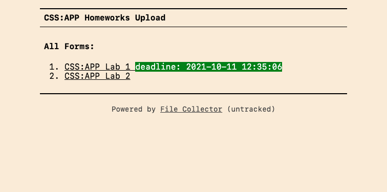
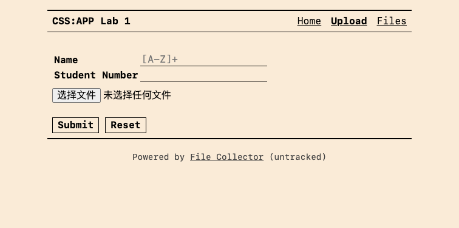
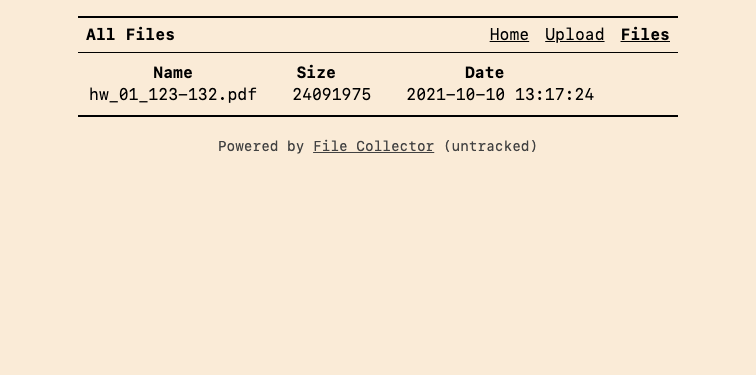

# File Collector

File Collector is an application that uses HTTP protocol to collect homework and files.

## Usage

When filecollector is run, it will automatically parse the configuration file (the default is filecollector.json), and then start an http server on the specified port.

```
Usage of ./filecollector:
  -c string
        config file path (default "filecollector.json")
  -v    show version
```

## Configuration

> the `deadline` and `pattern` are optional configuration items.

**example:**

```jsonc
{
  "host": "0.0.0.0",
  "port": 3000,
  "title": "CSS:APP Homeworks Upload",
  "forms": [
    {
      // URL prefix => http://127.0.0.1:3000/HW01
      "prefix": "HW01",
      // File storage path
      "storage": "./files/hw_01",
      "title": "CSS:APP Lab 1",
      // Form inputs are used in the filenameTemplate
      "inputs": [
        {
          "name": "name",
          "label": "Name",
          "pattern": "[A-Z]+"
        },
        {
          "name": "number",
          "label": "Student Number"
        }
      ],
      "deadline": "2021-10-11T04:35:06Z",
      "filenameTemplate": "hw_01_{{number}}-{{name}}"
    },
    {
      "prefix": "HW02",
      "storage": "./files/hw_02",
      "title": "CSS:APP Lab 2",
      "inputs": [
        {
          "name": "name",
          "label": "Name",
          "pattern": "[A-Z]+"
        },
        {
          "name": "number",
          "label": "Student Number"
        }
      ],
      "filenameTemplate": "hw_02_{{number}}-{{name}}"
    }
  ]
}
```

## Screenshots






